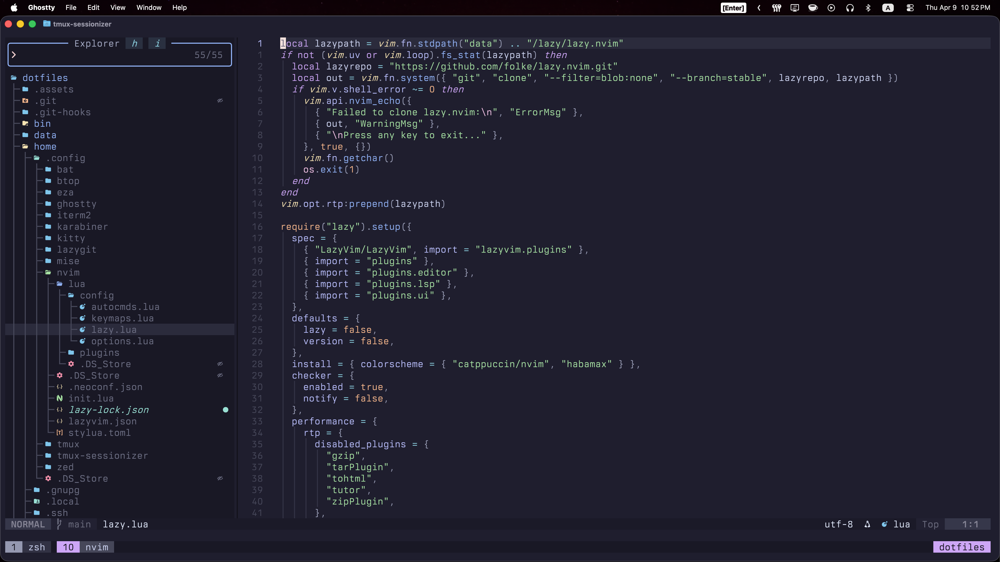

# dotfiles



```bash
make setup
```

## To Do

- [ ] Add installation of all possible apps via Homebrew casks, and display a message at the end listing apps that need to be installed manually (+ Add info message after installing particular app about what I need to configure in that one).
- [ ] Add commands to set up all my macOS system settings, and display a message at the end listing settings that need to be configured manually.
- [ ] Change Makefile scripts order.
- [x] Delete the "System Preferences" and "Apps" sections in "Setup" page of my website.
- [x] Link to this dotfiles can be moved to "About" page of my website.

## References for To Do

### System Preferences

- Appearance
  - Appearance: Auto
  - Show scroll bars: Always
  - Click in the scroll bar to: Jump to the spot that's clicked
- Apple Intelligence & Siri: false
- Control Center
  - Clock: Flash the time separators
  - Automatically hide and show the menu bar: Always
- Desktop & Dock
  - Position on screen: Left
  - Minimize windows using: Scale Effect
  - Animate opening applications: False
  - Automatically hide and show the Dock: True
  - Ask to keep changes when closing documents: True
  - Automatically rearrange Spaces based on most recent use: False
  - Group windows by application: True
  - Prefer tabs when opening documents: Never
  - Drag windows to screen edges to tile: False
  - Drag windows to menu bar to fill screen: False
  - Hold Option key while dragging windows to tile: False
  - Tiled windows have margins: False
  - Stage Manager: False
  - Show recent apps in Stage Manager: False
  - Click wallpaper to reveal desktop: Only in Stage Manager
  - Hot Corners: False
- Display
  - Automatically adjust brightness: False
  - Resolution: 1280x800
- Lock Screen
  - Show 24-hour time: False
- Trackpad
  - Tracking speed: Max
  - Click: Light
  - Dragging style: Three Finger Drag
  - Tap to click: On
  - Notification center: Off
- Keyboard
  - Key repeat rate: Max
  - Delay until repeat: Max
  - Adjust keyboard brightness in low light: False
  - Caps Lock: Control
  - Spotlight: Off
  - Press Globe key to: Do Nothing
  - Keyboard navigation: True
  - Input Sources: English (US), Russian (PC)
  - Correct spelling automatically: False
  - Capitalize words automatically: False
  - Show inline predictive text: False
  - Add period with double-space: False
  - Use smart quotes and dashes: False
  - Dictation: True
- Finder
  - New Finder windows show: Home Directory
  - Show all filename extensions: True
  - Remove items from the Trash: After 30 days
  - Show Path Bar: True
  - Show Status Bar: True
  - Create "Developer" directory in home directory
  - Create "Work" directory in home directory

### Apps

#### Browser
- Firefox
- Google Chrome
- Safari

#### Cloud
- Dropbox
- Google Drive
- One Drive

#### Communication
- Discord
- Microsoft Teams
- Signal
- Slack
- Telegram
- Zoom

#### Games
- Battle.net
- League of Legends
- Steam

#### Notes
- Notion
- Obsidian
- Todoist

#### Other
- Affinity Photo
- AltTab
  - Appearance: App Icons
- AppCleaner
- Audacity
- balenaEtcher
- Command X
- DeepL
  - Excluded apps: All related to programming
- GIMP
- IINA
- KeepingYouAwake
- KeyboardCleanTool
- Kindle
- Logi Options+
- OBS
- Raycast
  - Hotkey: CMD + Space
  - Navigation Bindings: Vim style
  - Clipboard History: CMD + Shift + C
- Spark
- Spotify
- Yandex Music
- Transmission
- Karabiner Elements
- Flameshot
- Stats
- Keycastr
- Aerospace
- Hiddenbar

#### Programming
- Cursor
- DBeaver
- Docker
- Excalidraw (PWA)
- Figma
- FileZilla
- Ghostty
- ImageOptim
- PostgreSQL
- Postman
- Racket
- VS Code
- WebStorm
- Zed

#### VM
- Multipass
- VirtualBox

#### VPN
- FoXray
- Outline
- Outline Manager
- Streisand
- WireGuard

#### Wallets
- Electrum
- Exodus
